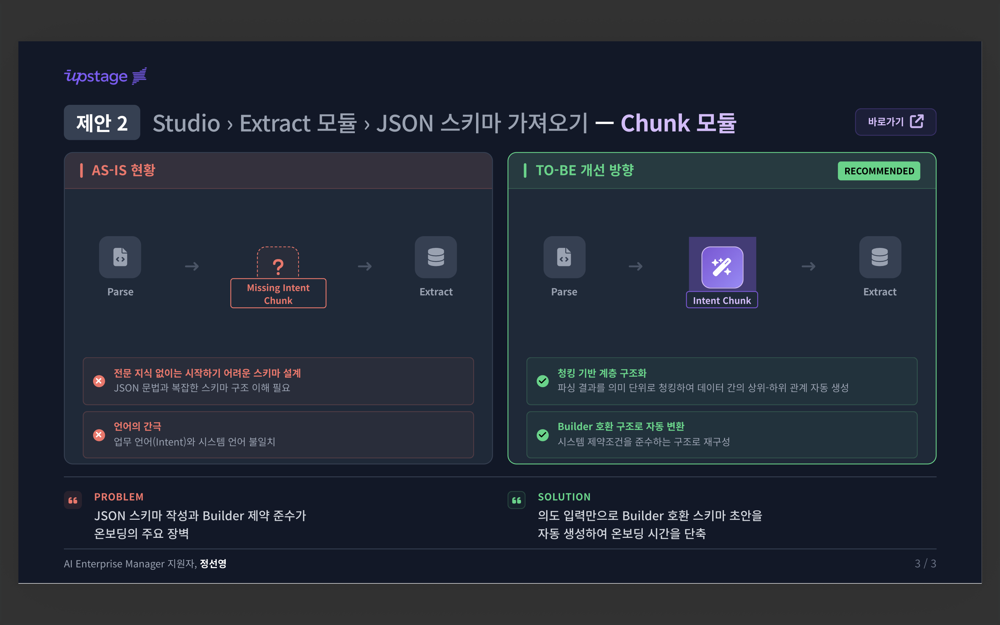

# 🍪 [Upstage] Studio > Chunk Module UI PoC

> `Parse → Chunk → Extract` 흐름에서, Chunk 패널 UX를 검증하기 위한 정적 목업 PoC입니다.

🔗 **Live Demo**: [https://graceful-semolina-d6a50d.netlify.app/](https://graceful-semolina-d6a50d.netlify.app/)

---

## 이 프로젝트의 현재 범위

이 저장소는 **UI/상호작용 PoC**에 집중합니다.

- 파일 업로드, 토글 전환, 복사/다운로드 같은 사용자 플로우 검증

다음 항목은 현재 구현되어 있지 않습니다.

- 실제 Parse 단계와의 자동 연동
- 서버 호출 기반 LLM 추론/스키마 생성
- 실제 문서별 동적 변환 결과 생성

---

## 실제 구현 기능

### 1) 입력 방식 전환 (Auto / 직접 업로드)

- `밀가루(raw)`와 `붕어빵 틀(mold)` 각각 Auto/User 토글 제공
- User 모드에서 JSON 파일 선택 및 Drag & Drop 업로드 지원
- JSON 파싱 실패/형식 오류 메시지 표시

### 2) 의도 입력 영역

- 자유 텍스트 입력창 제공 (placeholder 포함)
- 현재는 UX 검증용 입력이며, 실행 결과 계산에는 직접 반영되지 않음

### 3) 붕어빵 틀 Auto 하위 모드

- `저장된 설계(stored_schema)` / `스키마 자동 설계(llm_design)` UI 토글 제공
- 현재는 문구/상태 반영 중심이며, 실제 서버 설계 호출은 없음

### 4) 변환 실행 버튼

- 실행 시 로딩/성공 상태 전환
- 결과 영역에 고정 예시 JSON 렌더링
- 결과 복사/다운로드 제공

---

Built with Cursor AI · 업스테이지 Studio
